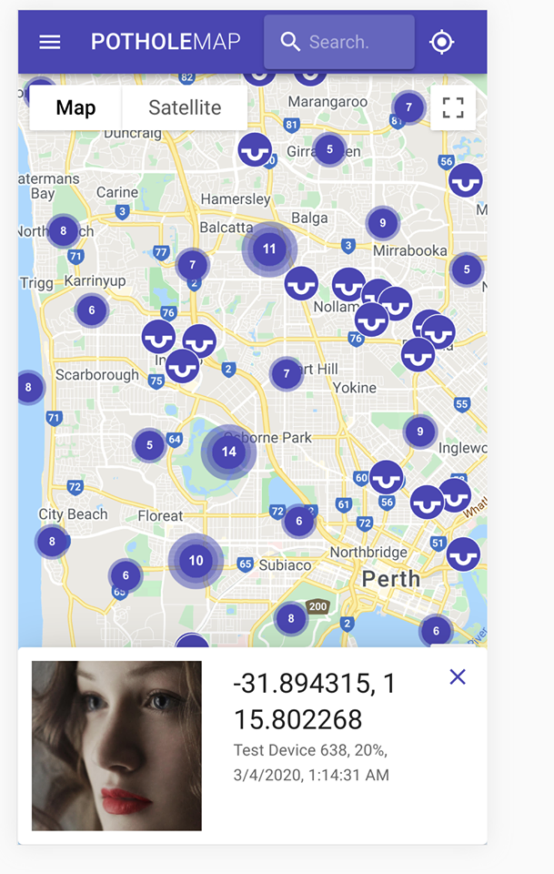
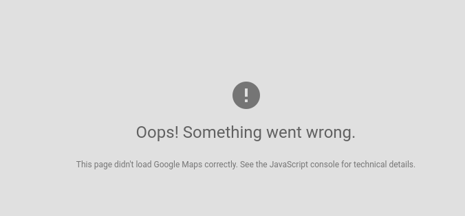

# Pothole Map
A Web/Mobile app for viewing pothole incidents as part of the [Devpost Facebook AI Hackathon](https://fbai1.devpost.com/). 



## Installation
You will need to generate a [Google Maps API key](https://developers.google.com/maps/documentation/javascript/get-api-key). Put this API key in ```.env.production```
```zsh
npm install
npm run dev
```
This application expects that you're running the lambdas in ``lambdas``.


## Common Issues

