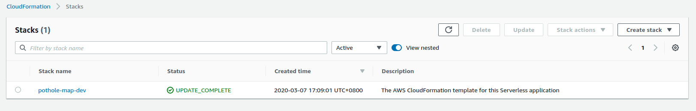

# AWS Lambdas for Pothole Maps
A collection of AWS Lambdas deployed using the [serverless framework](https://serverless.com/)


## Running Locally
```
npm install
npm run dev
```
Verify that it's running
```zsh
curl http://localhost:8888/query?nelat=-31.8&nelng=115.9&swlat=-32.0&swlng=115.7
```

## Deploying to Production


You will need to install the [Serverless Framework](https://serverless.com/framework/docs/getting-started/) and [AWS CLI](https://docs.aws.amazon.com/cli/latest/userguide/install-cliv2.html)

#### Linux
#####Install the AWS CLI V2
```zsh
curl "https://awscli.amazonaws.com/awscli-exe-linux-x86_64.zip" -o "awscliv2.zip"
unzip awscliv2.zip
sudo ./aws/install
```
Configure your AWS CLI account with your required Access/Secret keys and your default Region
```zsh
aws configure
```
#### Install the Serverless Framework
[Install Docker](https://docs.docker.com/install/)
```zsh
sudo apt-get update
sudo apt-get install \
    apt-transport-https \
    ca-certificates \
    curl \
    gnupg2 \
    software-properties-common
curl -fsSL https://download.docker.com/linux/debian/gpg | sudo apt-key add -
sudo add-apt-repository \
   "deb [arch=amd64] https://download.docker.com/linux/debian \
   $(lsb_release -cs) \
   stable"
sudo apt-get update
sudo apt-get install docker-ce docker-ce-cli containerd.io

```

If your distro is not supported by docker just yet you may need to [install from a previous release](https://github.com/docker/for-linux/issues/833#issuecomment-544257796)
```zsh
sudo add-apt-repository \
   "deb [arch=amd64] https://download.docker.com/linux/ubuntu \
   disco \
   stable"
```
Add yourself to the docker group, you may need to log in and log out for this to work.
```zsh
sudo groupadd docker
sudo usermod -aG docker $USER
```

Install the serverless framework
``curl -o- -L https://slss.io/install | bash``
###### Deploy
To deploy the stack Locally
```zsh
npm install
npm run dev
```
To Deploy to production AWS
```zsh
serverless deploy
```
You should then see that your stack has built.
```zsh
Service Information
service: pothole-map
stage: dev
region: us-east-1
stack: pothole-map-dev
resources: 11
api keys:
  None
endpoints:
  GET - https://1234567.execute-api.us-east-1.amazonaws.com/dev/query
functions:
  query: pothole-map-dev-query
layers:
  None
```
You can verify this in AWS Cloudformation


You should be able to query the endpoint
```zsh
curl https://1234567.execute-api.us-east-1.amazonaws.com/dev/query?nelat=-31.8&nelng=115.9&swlat=-32.0&swlng=115.7 
```