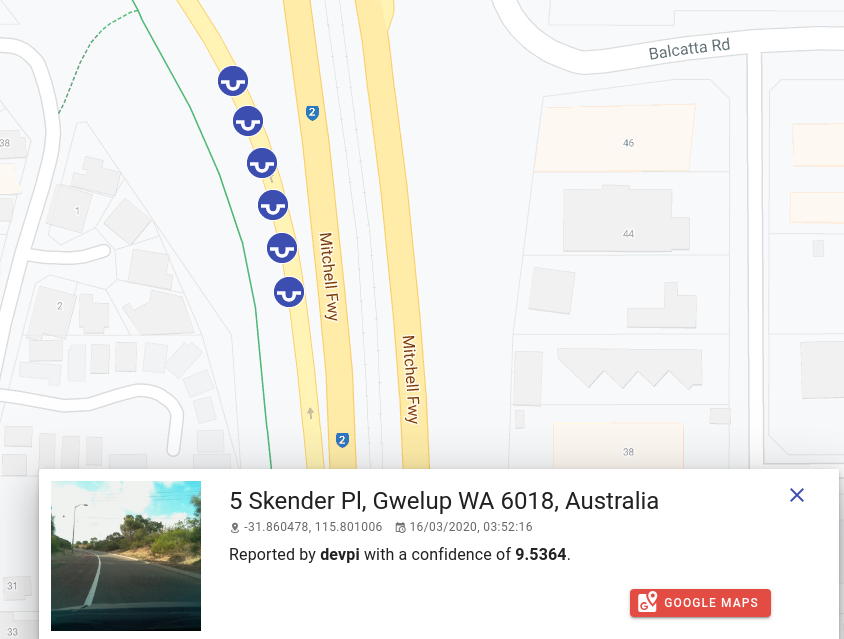
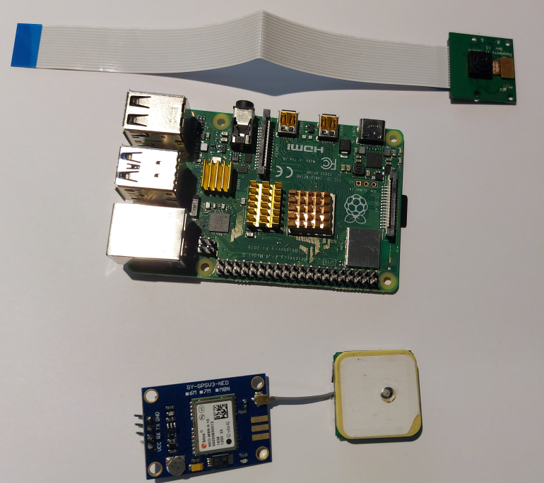
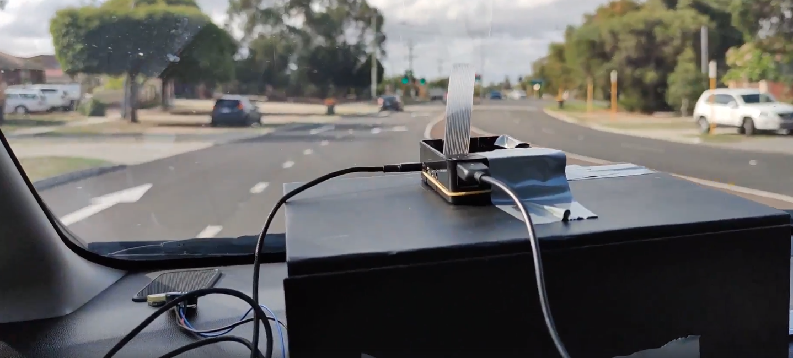

# Pothole AI


Pothole AI was designed after looking at a dashcam and asking "What if we used Edge Analytics on a dashcam to map out
 where potholes are, so that local governments and communities knew where to focus their efforts?".

It consists of two parts: 

* The Raspberry Pi based Camera using a PyTorch model to do edge inference of road quality 
* A website to aggregate readings and provide a full view of road conditions. 

The idea behind these two components is to allow members of the community to automatically record and upload road conditions using edge inference to reduce the data sent across the network. This data could then be displayed on a website to give communities and local governments a geographic density of potholes to give them a better idea of where to spend their efforts, or to find and fix potholes that haven't been reported (because lets face it, who's actually reported a pothole to your local council?).



We believe that this solution is nessessary because a quick google of pothole leads you to:
* Many questions on whether cities can be sued for damage to cars due to potholes
* News articles about [a village throwing a birthday party for a pothole]((https://metro.co.uk/2018/03/26/village-hold-first-birthday-party-for-pothole-outside-their-home-7417952/))
* News articles about a man who [despite warnings from the police is committed to filling in potholes himself](https://www.saltwire.com/news/despite-warning-from-police-stellarton-man-remains-committed-to-filling-in-potholes-off-exit-23-294924)
* News articles about a man [celebrating the third birthday of a pothole](https://news.yahoo.com/missouri-man-celebrates-3rd-birthday-185948993.html)

These articles are not an indication of a system that is working well.

Some of the more serious consequences of potholes include:
* Annual average cost to vehicles of $377 due to rough pavement
* Of approximately 33,000 traffic fatalities each year, one-third involve poor road conditions.

[source](https://www.pothole.info/the-facts/?fbclid=IwAR2AuMlIfkB8Fn3R-sgHxtHWIQdgjbj1CSIB3MS2yLx222Bqm5jGa3NnleU)

## Hardware

* [Raspberry Pi 4B](https://core-electronics.com.au/raspberry-pi-4-model-b-2gb.html)
* [Ublox Neo M8 GPS](https://www.aliexpress.com/item/32325420719.html?spm=a2g0o.productlist.0.0.34ef5707Xfqbmh)
* [Pi Camera](https://www.aliexpress.com/item/32846859601.html?spm=a2g0o.productlist.0.0.307623feOckDyl)
* [Optional: 3A Power Bank](https://www.amazon.com/gp/product/B07H6LB4J4/ref=as_li_ss_tl?ie=UTF8)
* [Optional: USB to FTDI converter](https://www.aliexpress.com/item/32826575637.html?spm=a2g0o.productlist.0.0.cfc529b09MN7sa)
* [Optional: Raspberry Pi Heatsink](https://www.aliexpress.com/item/4000348002518.html?spm=a2g0o.productlist.0.0.51b05477h9g8bc)

To build this system we used a Raspberry Pi 4B with a PiCam v2 and a Neo M8 GPS. The Raspberry Pi was responsible for
getting the current GPS position, taking a picture, running the PyTorch model to get a confidence score of the road being bad.


This information was then sent to an AWS Lambda endpoint which in turn, stores the latitude, longitude, device name and image into a database.


We would not recommend replacing the Pi Camera with a generic USB camera as the way we have written our code assumes a Pi Camera and results will be uncertain with a USB Camera.


You can substitute the Ublox Neo M8 GPS with a lot of different other models, so long as they support sending NMEA strings over UART and are powered by 3.3v-5v. 
We ended up passing ours through a FTDI -> USB header so we didn't need to worry about the setting up the Raspberry Pis GPIO pins.
 
 
After observing our system we would make three recommendations:
1. We would highly suggest putting a heatsink on the raspberry pi as it gets hot when doing inference like this.
2. We would suggest putting the camera slightly elevated on your cars dashboard. You may notice a ducted taped box that ours was sitting on.
We ended up discarding a lot of our initial readings because too much of the field of view was blocked by the windscreen wipers.

 __Note for those who are concerned: Australian steering wheels are on the right side of the car, not the left.__

3. Use a USB powerbank instead of a USB slot powered by your car.The Raspberry Pi is very particular about current/voltage.

## Software

### Deep learning
Deep learning can be very intimidating at first, and taking inspiration from [Fast.ai](https://www.fast.ai/) we wanted
 to show how easy it is to get something that works.

See notebook for a full end to end downloading and training example that will output a model.

We took the dataset curated by the amazing [M.J Booysen](https://www.researchgate.net/profile/Mj_thinus_Booysen)
which is an annotated dataset of labeled images of roads with an without potholes. 
While this dataset initially is meant to be used for localisation (locating potholes in images), we chose to use it as 
a classification dataset (image contains potholes or no potholes), [similar to Jian Yangs famous App](https://www.youtube.com/watch?v=pqTntG1RXSY).

We used the PyTorch hosted MobileNet V2 network, which is pretrained on Imagenet. 
This is a convolutional neural network which is small enough to be used in embedded applications.

We then cut off the classification layer to change it from trying to predict 1000 classes to just two.
```pytorch
Existing classifier
Sequential(
  (0): Dropout(p=0.2, inplace=False)
  (1): Linear(in_features=1280, out_features=1000, bias=True)
)
New classifier
Sequential(
  (0): Dropout(p=0.2, inplace=True)
  (1): Linear(in_features=1280, out_features=2, bias=True)
)
```
We used transfer learning to speed up the training process, freezing the initial weights of the imagenet trained model, 
and trained only our classifier. We then progressively unfroze more weight and trained at lower learning rates.

Once we had our saved model, we used this to perform inference on the raspberry pi, to allow us to only send data when the predicted score reached above a custom theshhold to conserve bandwith.

### Raspberry Pi
The Raspberry Pi software is available as a command line tool that can be installed with either ```pip``` or ```conda```.

It supports sending data to multiple endpoints (Aws SQS, HTTP Post, stdout or to a file) and is configurable via command line inputs and environment variables.

You can view the help command by typing --help on any of the commands provided by the cameraai python package.

#### CLI
```zsh
Usage: aicamera [OPTIONS] COMMAND [ARGS]...

Options:
  --camera_number INTEGER    Raspberry Pi camera number according to https://p
                             icamera.readthedocs.io/en/release-1.13/api_camera
                             .html#picamera, Default: 0
  --camera_invert BOOLEAN    Vertical invert camera, Default: False
  --baud_rate INTEGER        Baud rate on GPS, Default: 9600
  --serial_port TEXT         Serial port for GPS, Default: /dev/ttyUSB0
  --model_path TEXT          Pytorch Model Location, Default:
                             /home/pi/aicamera/models/thirdstep.model
  --device_name TEXT         Device Name, Default: devpi
  --min_predict_score FLOAT  Minimum prediction score to send, Default: 0.5
  --help                     Show this message and exit.

Commands:
  to_file
  to_http
  to_sqs
  to_stdout
```
####  Environment Variables
Most of these CLI options are also exposed as environment variables.
```zsh
# Base URL to send HTTP post to
# BASE_URL=127.0.0.1

# Vertical invert camera
# CAMERA_INVERT=False

# Raspberry Pi camera number according to https://picamera.readthedocs.io/en/release-1.13/api_camera.html#picamera
# CAMERA_NUMBER=0

# Device Name
# DEVICE_NAME=simul8

# Baud rate on GPS
# GPS_BAUD_RATE=9600

# Serial port for GPS
# GPS_SERIAL_PORT=/dev/ttyAMA0

# PyTorch Model Location
# MODEL_PATH=/opt/model
```

## Setup guide

### Website

Follow these steps to get the website ready for development and deployment.

#### Development

*   Install app dependencies:
    ```bash
    $ cd app
    $ npm install
    ```

*   Set app environment variables by creating the file `.env.local` with the following variables. You'll need a [Google Maps API key](https://developers.google.com/maps/documentation/javascript/get-api-key).
    ```bash
    VUE_APP_API_URL=http://localhost:8888
    VUE_APP_GOOGLE_MAPS_API_KEY=YOUR_GOOGLE_MAPS_KEY
    VUE_APP_GOOGLE_ANALYTICS_KEY=YOUR_GOOGLE_ANALYTICS_KEY
    ```

*   Start app in development mode:
    ```bash
    $ npm run dev
    ```

*   Create a Python virtual environment and install lambda dependencies:
    ```bash
    $ cd lambdas
    $ virtualenv --python python3 venv
    $ source venv/bin/activate
    $ pip install -r requirements.txt
    $ npm install
    ```

*   Set lambda environment variables by creating the file `.env.development` with the following variables:
    ```bash
    DEBUG=True
    PRODUCTION=False

    QUERY_MAX_RESULT_COUNT=100
    QUERY_DEFAULT_RESULT_COUNT=10

    PHOTO_BUCKET_NAME=S3_BUCKET_NAME
    PHOTO_KEY_PREFIX=potholes/

    DB_HOST=YOUR_DATABASE_HOST
    DB_PORT=YOUR_DATABASE_PORT
    DB_NAME=YOUR_DATABASE_NAME
    DB_USER=YOUR_DATABASE_USER
    DB_PASSWORD=YOUR_DATABASE_PASSWORD
    ```

*   Start lambdas in development mode:
    ```bash
    $ npm run dev
    ```

#### Building & Deployment

*Be sure to check your AWS keys and `serverless.yml` before deployment as to not incur costs.*

*   Run the following commands to create a production build of the front-end app. The content of the resulting `dist/` folder can be uploaded onto any static site hosting provider. We're using [Firebase](https://firebase.google.com/).
    ```bash
    $ cd app
    $ npm run build
    ```

*   Deploy lambdas using serverless:
    ```bash
    $ cd lambdas
    $ npm run deploy
    ```


### Pi
Run these commands on a raspberry pi with an internet connection. 

If you're running this on a corporate proxy you may need to modify you http_proxy, https_proxy environment settings on the Raspberry Pi.

### Enable Pi Camera
Configure the camera with ```raspi-config```

Give your pi user permission to access serial devices.
```zsh
usermod -a -G dialout pi
```

#### Install PyTorch
```
git clone --recursive https://github.com/pytorch/pytorch
cd pytorch
git submodule update --remote third_party/protobuf
sudo -E USE_MKLDNN=0 USE_QNNPACK=0 USE_NNPACK=0 USE_DISTRIBUTED=0 BUILD_TEST=0 python3 setup.py install
```
### Install TorchVision
```
git clone --recursive https://github.com/pytorch/vision.git
cd vision
sudo -E USE_MKLDNN=0 USE_QNNPACK=0 USE_NNPACK=0 USE_DISTRIBUTED=0 BUILD_TEST=0 python3 setup.py install
```

### Install CameraAi
```
sudo apt update
sudo apt upgrade -y
sudo apt-get install python-picamera python3-picamera libopenjp2-7 libtiff5 -y
sudo apt install libopenblas-dev libblas-dev m4 cmake cython python3-dev python3-yaml python3-setuptools -y
git clone https://github.com/SrzStephen/Aicamera.git
cd Aicamera
pip3 install -r requirements.txt
pip3 install .
```
You should then be able to type ```cameraai``` and see the help page come up.

You can use the ```cameraai.service``` file in the unit file directory to auto start the cameraai program on boot, do to this:
```zsh
cp unit/cameraai.service /etc/systemd/system/cameraai.service
sudo systemctl enable cameraai
sudo systemctl start camereaai
```
You will probably want to modify the ```ExecStart``` command to what you want and point the ```--model_path``` parameter to the model you wish to use. 

Available in this repo are ```firststep.model``` ```secondstep.model``` ```thirdstep.model``` which represent each of the training sages. By default you will use ```thirdstep.model```.

### Model Notebook
While the pretrained models are available in the ```models``` directory, you can train it yourself.

The full code required to train the model is available in the ```training``` folder.

We would suggest training this on a computer with a decent GPU as it is time intensive otherwise. The notebook should work on your system without modification. If it doesn't then please reach out to us with a link to what was giving you an error.

To use a different model on the raspberry pi, copy it to your Pi and refer to it by the ```--model_path``` option.

## Challenges we ran into

## What we ran into problems with
### No prebuilt python wheels on PiPi for Arm71
Currently pipi does not have any Armv71 (Raspberry Pis current architecture) wheels for PyTorch. 
There are currently some issues compiling PyTorch from source on a Raspberry Pi [shout out to Minki-Kim95 for their post of how to fix this.](https://github.com/pytorch/pytorch/issues/26455.) Compiling PyTorch on a Raspberry pi took 2+ hours.
 
The version of torchvision in PiPi for Arm71 is very old and does not support ```torchvision.models```. The latest version also had to be compiled from source (this was a lot faster).

### Edge deployment
Initially we were planning to use AWS Greengrass to deploy the model to the cloud. What we found when writing the guide
 was that it was becoming too complicated to write for someone who didn't have extensive AWS experience to follow so we scrapped it.

### Disk Persistence 
Initially as part of the AWS Greengrass deployment we were going to use [Apache NiFi](https://nifi.apache.org/) to give some on disk persistence for when you don't have an internet connection. A perfect use case for this is if you only wanted to upload images when you were on wifi.

We ended up removing this part as it made it too complicated for an end user to use and made it a lot more difficult for someone to debug.


### Running the model.
To collect initial data we drove around for ~45 minutes. Unfortunately after turning the device off we realised we were logging to ```/tmp/``` which deletes itself on power down. Whoops.


# Thanks
Thanks to M.J Booysen for his data on pot holes.
[1] S. Nienaber, M.J. Booysen, R.S. Kroon, “Detecting potholes using simple image processing techniques and real-world footage”, SATC, July 2015, Pretoria, South Africa.
[2] S. Nienaber, R.S. Kroon, M.J. Booysen , “A Comparison of Low-Cost Monocular Vision Techniques for Pothole Distance Estimation”, IEEE CIVTS, December 2015, Cape Town, South Africa.

Thanks to [Minki-Kim95](https://github.com/pytorch/pytorch/issues/26455.) for their answers on Github for how to compile PyTorch from source on a Raspberry Pi

Thanks to [ptrblck](https://discuss.pytorch.org/u/ptrblck/summary) for all the questions he has answered on the PyTorch forums. When we were looking at forum posts for things we didn't know he was the one who answered a lot of questions.
